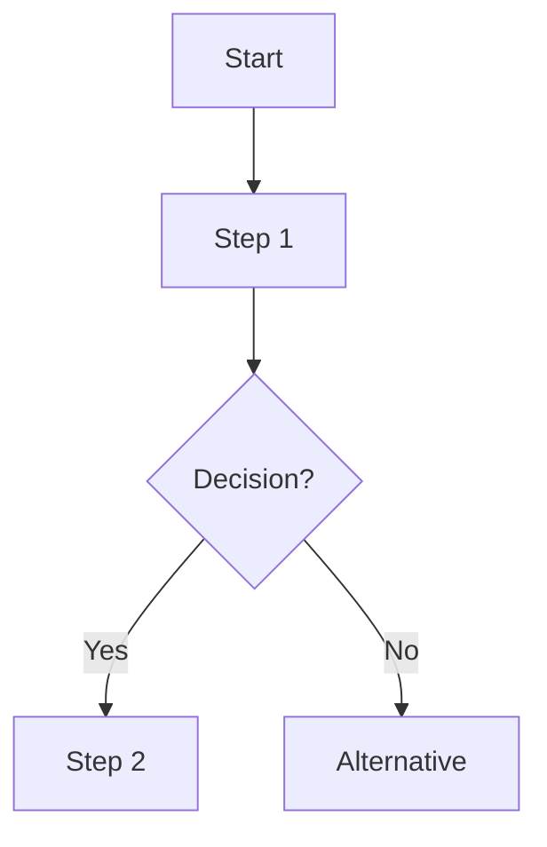
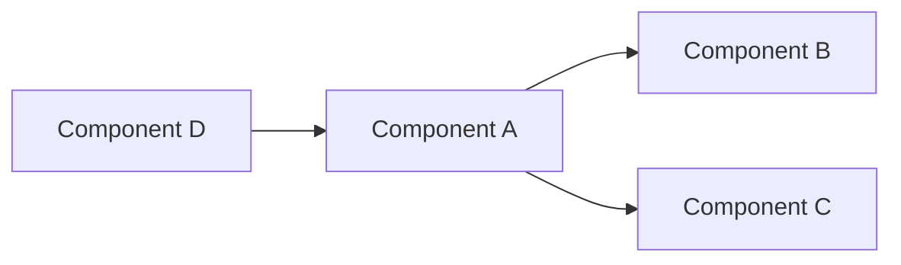
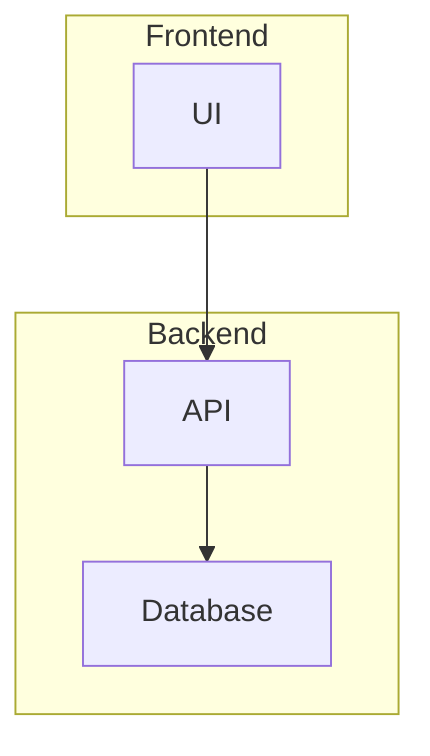

# Markdown Optimizer

Optimize markdown documents to maximize information density and LLM parsing efficiency while preserving semantic meaning.

## Optimization Approaches

### Automated Optimization (Recommended First Step)

Use the bundled script for initial optimization:

```bash
python scripts/optimize_markdown.py input.md output.md
```

The script automatically:
- Adds YAML front-matter with title, token estimate, key concepts, and TOC
- Normalizes heading hierarchy (ensures no skipped levels)
- Removes noise (excessive horizontal rules, redundant empty lines)
- Identifies diagram opportunities (process flows, relationships, architecture)
- Generates structured metadata for LLM reference

**Token estimates:** The script adds metadata (~50-150 tokens) but identifies optimization opportunities that typically yield net reductions of 20-40% when manual optimizations are applied.

### Manual Optimization (Apply After Automated)

After running the script, review and apply manual optimizations:

1. **Review suggested_diagrams in front-matter** - Create Mermaid diagrams for flagged sections
2. **Convert verbose prose to structured formats** - Use tables, definition lists where appropriate
3. **Consolidate redundant examples** - Merge similar code examples
4. **Strip unnecessary emphasis** - Remove excessive bold/italic that doesn't add semantic value

Consult `references/optimization-patterns.md` for detailed patterns and examples.

## Workflow

### For Single Documents

1. Run automated optimizer:
   ```bash
   python scripts/optimize_markdown.py document.md document-optimized.md
   ```

2. Review output, especially:
   - `suggested_diagrams` - sections flagged for visualization
   - `concepts` - verify key topics are captured
   - `toc` - ensure structure is logical

3. Apply manual optimizations using patterns from references/optimization-patterns.md

4. Create Mermaid diagrams for suggested sections

5. Verify all key information preserved

### For Multiple Documents

When optimizing related documents, add relationship metadata:

```yaml
---
title: "API Authentication"
related_docs:
  - api-reference.md
  - security-guide.md
dependencies:
  - python>=3.8
  - requests
---
```

This helps LLMs understand document connections when used as references.

## Front-Matter Schema

The optimizer generates this structure:

```yaml
---
title: "Document Title"              # From first H1 or filename
tokens: 1234                         # Estimated token count
optimized_for_llm: true              # Optimization flag
concepts:                            # Top 5 key concepts/topics
  - ConceptA
  - ConceptB
toc:                                 # Table of contents
  - Heading 1
    - Heading 2
      - Heading 3
suggested_diagrams:                  # Sections that could use visualization
  - section: "Section Name"
    type: flowchart                  # or: graph, architecture
---
```

Add manually when relevant:
```yaml
related_docs: [file1.md, file2.md]  # Document relationships
dependencies: [tool1, tool2]         # Required tools/libraries
audience: developers                 # Target audience
status: published                    # Document status
```

## Diagram Integration

When front-matter suggests diagrams, create them using Mermaid syntax. Common patterns:

**Process Flow (type: flowchart)**


**Relationships (type: graph)**


**Architecture (type: architecture)**


See references/optimization-patterns.md for comprehensive diagram patterns.

## Best Practices

**Do:**
- Run automated optimizer first to establish baseline
- Review suggested diagrams - they often highlight unclear prose
- Preserve all semantic information
- Test that code examples still work
- Verify cross-references remain intact

**Don't:**
- Optimize creative writing or legal documents
- Remove explanatory context that aids understanding
- Over-compress at expense of clarity
- Apply to already-concise technical specs

## Quality Verification

After optimization, confirm:
1. Front-matter is complete and accurate
2. Key information preserved
3. Logical flow maintained  
4. Token count reduced or value added
5. Document is more scannable

## Integration with Other Skills

Optimized markdown works well as:
- Reference material loaded by other skills (`references/` directories)
- Input to prompt construction
- Knowledge base entries
- Technical documentation ingested by LLMs

Store optimized documents in skill `references/` directories when they provide domain knowledge that Claude should access on-demand.
