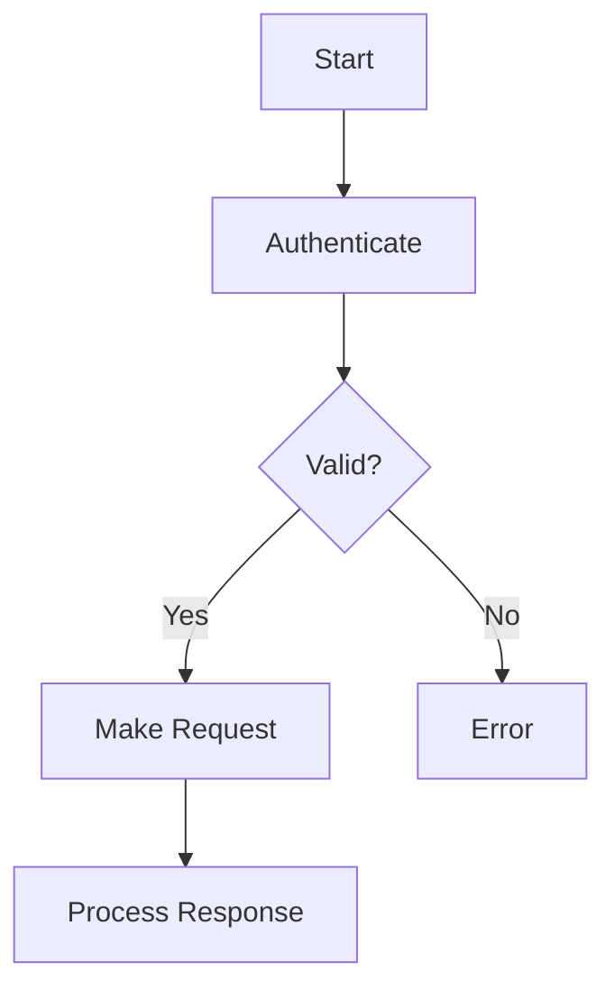
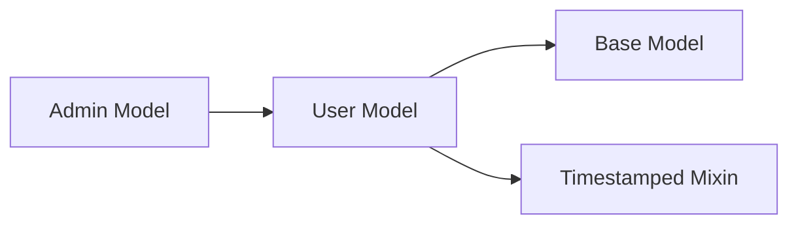
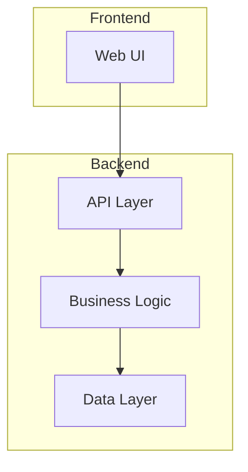
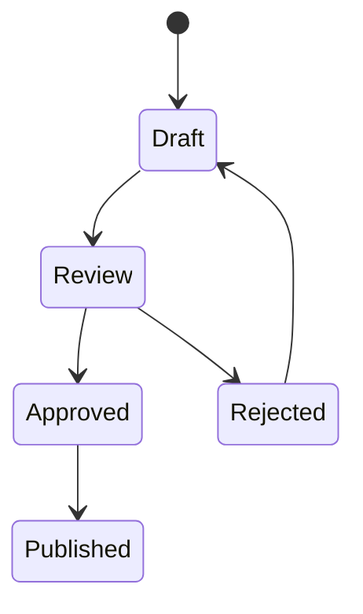

# Advanced Markdown Optimization Patterns

This reference provides patterns for manual markdown optimization beyond what the automated script handles.

## Content Restructuring Patterns

### Verbose Prose → Structured Format

**Pattern: Convert explanatory lists to tables**

Before:
```
The API supports three authentication methods. OAuth2 is recommended for web applications and provides secure token-based authentication. API keys are suitable for server-to-server communication and are simpler to implement. Basic Auth should only be used for testing as it's less secure.
```

After:
```
| Method | Use Case | Security |
|--------|----------|----------|
| OAuth2 | Web applications | High (recommended) |
| API Keys | Server-to-server | Medium |
| Basic Auth | Testing only | Low |
```

**Pattern: Convert sequential steps to definition lists**

Before:
```
To deploy the application, first build the Docker image using the Dockerfile in the root directory. Then push the image to your container registry. After that, update the Kubernetes deployment manifest with the new image tag. Finally, apply the manifest using kubectl.
```

After:
```
**Build**
: Create Docker image from root Dockerfile

**Push**
: Upload image to container registry

**Update**
: Modify K8s manifest with new tag

**Deploy**
: Apply manifest via kubectl
```

### Consolidate Redundant Examples

**Pattern: Merge similar code examples**

Before:
```python
# Example 1: Create user
user = create_user(name="Alice")

# Example 2: Create another user
user2 = create_user(name="Bob")

# Example 3: Create admin user
admin = create_user(name="Charlie", role="admin")
```

After:
```python
# Create users with optional role
user = create_user(name="Alice")  # default role
admin = create_user(name="Charlie", role="admin")
```

### Strip Unnecessary Markdown Syntax

**Pattern: Remove emphasis that doesn't add semantic value**

Before:
```
**Note:** The API endpoint is **very important** and you should **always** include authentication.
```

After:
```
Note: Include authentication with all API requests.
```

**Pattern: Simplify excessive nested lists**

Before:
```
- Step 1
  - Substep A
    - Detail i
    - Detail ii
  - Substep B
```

After:
```
**Step 1**
- A: Detail i, Detail ii
- B: [description]
```

## Diagram Creation Patterns

### Process Flows → Flowchart

Indicators: "step 1", "then", "next", "process", "workflow"



### Relationships → Graph

Indicators: "depends on", "inherits from", "composed of"



### Architecture → Component Diagram

Indicators: "architecture", "components", "system design", "layers"



### State Transitions → State Diagram

Indicators: "status", "state", "transitions", "lifecycle"



## Content Compression Techniques

### Remove Filler Phrases

Remove:
- "It's important to note that..."
- "As mentioned previously..."
- "In order to..."
- "Due to the fact that..."
- "For the purpose of..."

Replace with direct statements.

### Use Domain Abbreviations

When context is clear:
- Authentication → Auth
- Application → App
- Configuration → Config
- Documentation → Docs
- Environment → Env
- Repository → Repo

### Consolidate Repeated Context

Before:
```
## User Creation Endpoint
The user creation endpoint allows you to create new users.

## User Update Endpoint
The user update endpoint allows you to update existing users.

## User Delete Endpoint
The user delete endpoint allows you to delete users.
```

After:
```
## User Endpoints

| Endpoint | Purpose |
|----------|---------|
| POST /users | Create |
| PUT /users/:id | Update |
| DELETE /users/:id | Delete |
```

## Front-Matter Best Practices

### Essential Fields

Always include:
```yaml
---
title: "Document Title"
tokens: 1234  # Estimated token count
optimized_for_llm: true
---
```

### Optional but Valuable Fields

```yaml
related_docs:
  - auth.md
  - api-reference.md

dependencies:
  - python>=3.8
  - requests

audience: developers  # or: beginners, experts, etc.

status: draft  # or: review, published, deprecated
```

### TOC Depth Guidelines

- For documents <500 tokens: H1, H2 only
- For documents 500-2000 tokens: H1, H2, H3
- For documents >2000 tokens: Full hierarchy

## Optimization Decision Tree

```
Is the document <200 tokens?
├─ Yes: Minimal optimization (front-matter only)
└─ No: Continue

Does it contain repetitive examples?
├─ Yes: Consolidate examples
└─ No: Continue

Are there process descriptions?
├─ Yes: Consider flowchart diagram
└─ No: Continue

Are there relationship descriptions?
├─ Yes: Consider graph diagram
└─ No: Continue

Is prose verbose?
├─ Yes: Convert to tables/lists
└─ No: Continue

Apply final polish:
- Normalize headings
- Remove noise
- Add front-matter
```

## When NOT to Optimize

Avoid optimization for:
- Creative writing (stories, poems)
- Legal documents (precision required)
- Already-concise technical specs
- Code with extensive comments (explanatory value)
- Documents with careful narrative structure

## Quality Checks

After optimization, verify:
1. ✅ All key information preserved
2. ✅ Logical flow maintained
3. ✅ Code examples still functional
4. ✅ Cross-references intact
5. ✅ Front-matter accurate
6. ✅ Token count reduced or value added
